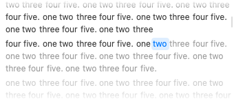

# Long-text reader changes and validation

The reader now tokenizes text once in a cancellable background task and renders
bounded display blocks independently of synthesis chunks. A block contains at
most 32 tokens / 512 token characters; even a single unbroken string is split
into bounded pieces without inserting spaces. Word layout caches arrangements
for a bounded set of widths. Following uses stable top-level scroll targets and
a single `ScrollPosition` for both automatic and user scrolling. User-driven scroll positions and
tracking/interaction phases disengage following. Offscreen seeks first materialize
a stable block, then use measured word coordinates to keep the active word inside
the unfaded viewport. A vertical comfort band prevents scrolling on every word;
new targets supersede old ones without queued animations. Geometry is retained
only for rendered words and removed when they disappear.

Speech boundaries include inserted paragraph silence and finalized audio ends.
History persists these boundaries and restores them on replay.

**Word timing is approximate.** The reader distributes words within each chunk's
speech interval using source character offsets, and clicking a word seeks to that
estimate. Every chunk re-anchors to its own audio boundaries, excluding known
paragraph silence. An unfinished chunk uses a fixed rate estimate from the preceding
completed chunk (or a default rate); accumulating PCM does not continually stretch
its word times backward. Finalization replaces that estimate with the actual end.
Words estimated beyond available audio cannot be clicked yet. Old recordings
without valid timing use a coarse whole-recording proportional fallback.

The speech engines do not expose word timestamps. Pronunciation and pauses can
still differ from these estimates, and finalizing an unfinished chunk can adjust
the highlighted word. This preserves word following without claiming forced
alignment or adding a recognition model.

Transcript, waveform, and timing have separate transport revisions. Waveform
updates omit the transcript and timing; timing updates replace only the changed
suffix. Full snapshots and resets restore all content. The bundled service
protocol advances to version 8 because older clients cannot apply these deltas.

The text chunker maintains character cursors, uses bounded lookahead for oversized
sentences, passes known offsets into slices, and checks cancellation while scanning
and fitting model inputs. Model-specific phonemization/fitting runs on the next
logical chunk rather than the entire document before first audio.

## Measured comparison

Optimized standalone probes use synthetic input and production source. These are
reader-host measurements, not full application launch or model inference times.

| Probe | Before | After |
| --- | ---: | ---: |
| Initial reader, 10,000 words | 3.562 s | 0.151 s |
| Initial reader, 100,000 words | Not run | 0.179 s |
| Word measurements, 10,000 words | 90,000 | 288 |
| Word measurements, 100,000 words | Not run | 288 |
| Full tokenization, 100,000 words | Scan alone: 0.127–0.142 s | 0.023 s |
| Chunking 248,000 characters in Unicode paragraphs | 2.553 s | 0.816 s |
| Chunking one 280,000-character Unicode sentence | 0.694 s | 0.021 s |

Twenty streaming/seek updates retained exactly one tokenization for a
100,000-word document. The probe asserts bounded view/layout work and fails if
those updates retokenize the document or the followed word fails to enter the
viewport. A second view test checks 101 successive word targets, including line
and block crossings, large forward/backward seeks, the first word, and the final
word of a 100,000-word document. Each target must be inside the unfaded viewport;
this caught a missed geometry update at a line transition during development.

Run:

```sh
bash Review/run-long-text-probe.sh
bash Review/run-long-text-probe.sh render-series
bash Review/run-long-text-probe.sh render-updates 100000
bash Review/run-long-text-probe.sh render-words 100000
```

The UI probe creates a temporary instrumented copy of the reader to count word
view evaluations, layout measurements, and tokenization publication. No production
instrumentation or build products are committed. The optional
`SAYIT_PROBE_SCREENSHOT` environment variable writes a synthetic reader screenshot.

## Regression coverage

- Bounded layout for 100,000 words and enormous unbroken Unicode strings.
- Exact Unicode source offsets, paragraph breaks, repeated words, and cancellation.
- Streaming stability, silence gaps, seeking backward, half-open text boundaries,
  finalized ends, and proportional fallback for missing legacy anchors.
- Approximate word progression, stable incomplete-chunk estimates, rate adaptation,
  finalization corrections, whitespace gaps, and chunk splits inside a token.
- Viewport comfort bands, reverse movement, edge clamping, and invalid geometry.
- History timing persistence across store reloads, replay restoration, malformed
  data, invalid ranges, and failure cleanup.
- Waveform-only updates, timing suffix append/finalization, missed-event catch-up,
  same-text playback resets, invalid deltas, and protocol round trips.
- Long Unicode paragraph/sentence chunking and cancellation during model fitting.

Validation completed successfully:

- Full package suite: **302 tests in 54 suites passed**.
- `Scripts/validate-catalog.sh`: passed.
- `Scripts/build-app.sh`: local Release app built successfully, including signature
  and package-linkage validation. Third-party dependency warnings remain.
- Standalone rendering, streaming/seek, timing, and chunking probes: passed.
- `git diff --check` and probe shell syntax validation: passed.

The final streaming/seek probe retained one tokenization, issued all 20 follow
requests, and verified that the final target word was visible. Its screenshot
uses synthetic text:



 MLX tests require the app's compiled Metal library alongside the test
executable, following the repository's existing test setup. GPU tests also need
access to Metal. No live voice-model generation or audio/text upload is used by
these probes.
